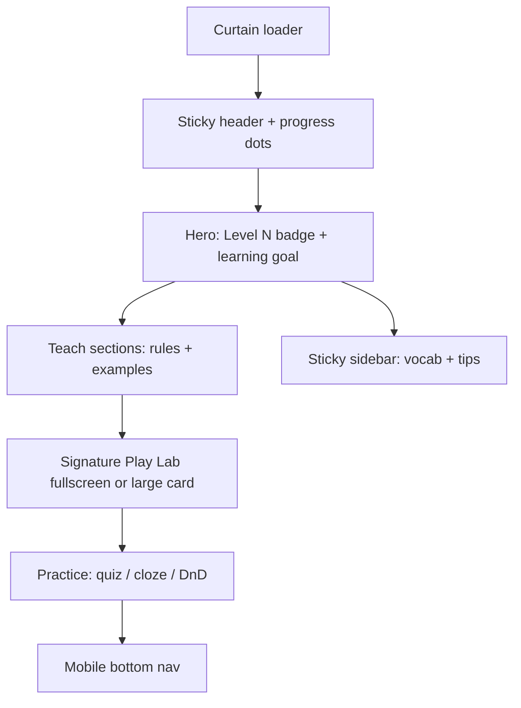

# English Language Skill Course (12 Levels)

## Goal

Create **12 progressive, immersive HTML lessons** for an **English Language** skill track, separate from academic `output/class 4/`. Each page matches the existing EdTech look (Poppins/Inter, navy/green/amber, curtain, sticky header, 65/35 layout, GSAP + Lenis) but ships **one signature game mechanic per level**—no repeated MediaPipe-heavy patterns.

## Folder structure

```
output/
  Skill Based/
    english-language/
      index.html          # Course hub (level cards, progress)
      01.html … 12.html   # One level per file
      assets/             # Optional shared SVGs only (keep pages self-contained by default)
```

Metadata comment on each file:

```html
<!-- TRACK: Skill Based | COURSE: English Language | LEVEL: 3 | VERSION: 1.0 -->
```

Reference patterns from:
- Layout/shell: [`output/class 4/english/01.html`](output/class 4/english/01.html), [`output/class 4/math/03.html`](output/class 4/math/03.html)
- Canvas game: [`output/class 4/math/08.html`](output/class 4/math/08.html) (Liquid Lab)
- Gesture sort: [`output/class 4/science/01.html`](output/class 4/science/01.html) + `zb-01-gesture-immersive.js`
- Post-patch tooling model: [`tools/insert_boxing.py`](tools/insert_boxing.py), new `tools/skill-based/` for reusable fragments

## Shared page architecture (all 12 levels)

Each `NN.html` follows the same skeleton so UX feels like one course:



**Shared stack (no MediaPipe by default):**
- Google Fonts: Poppins + Inter
- GSAP + ScrollTrigger, Lenis
- Mermaid for 1 diagram where helpful (grammar trees, sentence structure)
- Inline CSS + JS (single-file deploy, same as academic pages)

**New shared snippet** (copied into each file, maintained once in `tools/skill-based/shared-theme.css` + `shared-shell.html` for consistency):
- `:root` tokens: `--green`, `--navy`, `--amber`, `--light-green`, `--border-radius`
- `#curtain`, `.sticky-header`, `.hero`, `.content-grid`, `.playlab-teaser`, mobile nav
- Level badge: `Level 1 / 12` + difficulty stars

**Hub page** [`index.html`](output/Skill Based/english-language/index.html):
- Grid of 12 cards (title, skill tag, stars, “Play” link)
- `localStorage` progress: completed levels, best score
- Optional soft lock: Level N+1 unlocks after Level N completion (can be toggled off for teachers)

## Design rule: one unique mechanic per level

**MediaPipe policy:** Use on **at most 1 of 12** levels (optional Level 11 “Speak & Sort” with Web Speech API as primary; camera only as fallback). All other levels use touch, keyboard, canvas, audio, or motion APIs.

| Level | Focus (English) | Signature mechanic | Tech (no MediaPipe) |
|-------|-----------------|--------------------|---------------------|
| **1** | Letters & sounds (CVC) | **Letter Pop** — pop bubbles in A→Z / sound order | Click/tap + GSAP particles |
| **2** | Rhyming words | **Rhyme Bridge** — draw SVG lines between rhyming pairs | SVG paths + drag |
| **3** | Articles a / an / the | **Article Toss** — flick word balls into labeled bins | CSS transforms + simple physics (or lightweight Matter.js) |
| **4** | Sentence word order (SVO) | **Sentence Train** — reorder carriage cards on a track | Sortable drag + snap animations |
| **5** | End punctuation (. ? !) | **Punctuation Pop** — pop only the correctly punctuated sentence bubbles | Canvas 2D + timer |
| **6** | Nouns vs verbs | **Sort Sprint (tap)** — fast tap-sort into two lanes (reuse *pattern* from science/01 tap mode, new English tiles) | Touch only |
| **7** | Adjectives & descriptions | **Paint the Picture** — pick adjectives to fill a scene; scene updates via SVG layers | SVG layer toggles |
| **8** | Plurals & possessives ('s) | **Grammar Detective** — click the wrong word in a passage; spotlight + shake | DOM highlight + GSAP |
| **9** | Past tense (regular) | **Time Machine Dial** — rotate dial / slider to transform verbs present→past | Custom dial UI + GSAP |
| **10** | Connectors (and, but, because) | **Story Bridge** — drag connector tiles to complete comic-strip panels | Drag-drop + panel strip |
| **11** | Speaking & listening | **Echo Chamber** — repeat phrase; **Web Speech API** recognition scores match | `SpeechRecognition` + tap fallback |
| **12** | Short story + editing | **Story Architect** — build then proofread a 4-sentence story; boss round combines prior skills | State machine + multi-step UI |

Difficulty ramps via: shorter time limits, more distractors, longer passages, combined rules (Level 12), and stricter scoring.

## Content & pedagogy per level

Each page includes (in addition to the game):
- **Learning objective** (1 sentence in hero)
- **Teach** block: 2–3 rules with highlight boxes + 2 worked examples
- **Play Lab** teaser section (like `#sec-boxing` in math/03) launching fullscreen or expanded game
- **Practice**: 5–8 questions (quiz or cloze) reinforcing the same skill
- **Sidebar**: key vocabulary (4–6 terms) + “Remember” tip
- **Scoring**: stars (1–3) stored in `localStorage` per level

Content is **authored for Class 4** (ages ~8–9): short sentences, high-frequency words, Pakistani-neutral contexts (school, park, family, cricket)—aligned with tone of existing [`output/class 4/english/`](output/class 4/english/) units but not tied to PDF unit numbers.

## Implementation approach

### Phase 1 — Foundation (1 session)
1. Create folder `output/Skill Based/english-language/`
2. Add `tools/skill-based/` fragments: `shared-theme.css`, `shared-nav.html`, `hub-template.html`
3. Build **`index.html`** hub + **`01.html`** (Letter Pop) as the gold-standard template
4. Verify: curtain, Lenis, progress dots, mobile nav, play lab open/close, localStorage score

### Phase 2 — Levels 2–6 (mechanics batch A)
Build pages with distinct JS modules inlined per file (or `zb-en-02-rhyme.js` siblings + optional `inline` script later):
- 02 Rhyme Bridge, 03 Article Toss, 04 Sentence Train, 05 Punctuation Pop, 06 Noun/Verb Sort

### Phase 3 — Levels 7–12 (mechanics batch B)
- 07 Paint the Picture, 08 Grammar Detective, 09 Time Machine, 10 Story Bridge, 11 Echo Chamber (Speech API), 12 Story Architect

### Phase 4 — Polish & QA
- Cross-link hub ↔ levels; prev/next footer on each level
- Accessibility: keyboard fallbacks, `aria-live` for score messages, reduced-motion CSS
- Test on Chrome + mobile Safari (especially Level 11 speech)
- Light pass on file size (keep each HTML under ~250KB where possible)

## What we will NOT do

- Run all 12 through `generate.py` PDF pipeline (no source PDFs; hand-crafted for game quality)
- Copy MediaPipe onto every page
- Duplicate boxing/magnet/head-tilt verbatim (only reuse *patterns*, e.g. fullscreen shell, tap-sort lane UI)

## Success criteria

- 12 playable levels + hub, consistent theme with academic Class 4 pages
- Each level feels **visually and mechanically different**
- Difficulty clearly increases from Level 1 → 12
- Works offline after first load (CDN fonts/scripts except optional speech)
- Teacher can open any level directly via `index.html` or `NN.html`

## Estimated effort

| Phase | Deliverable |
|-------|-------------|
| 1 | Hub + Level 1 template |
| 2 | Levels 2–6 |
| 3 | Levels 7–12 |
| 4 | QA + cross-links |

Roughly **12 substantial HTML files** (~1,200–2,000 lines each with game + lesson content)—plan for incremental delivery and review after Level 1 and Level 6.
